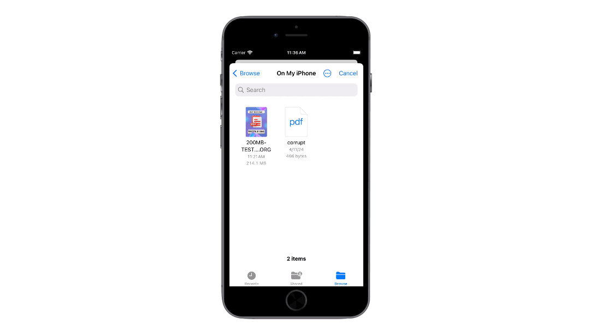

#  Integrating PDF import in SwiftUI 

## Description 

This project shows an example of how to use the file importer in SwiftUI and reflecting different states by an enum.

## How to use the project 

The project was tested for iPhone SE for the iOS Version 17. You need at least the Xcode version 15 to use the project. 

## Structure of the project

### `Views`

Holds all views that are displayed and used in the app.

### `Constants`

Contains the files `Dimens` (defines sizes), `Texts` (defines strings) and `ImageNames` (defines image names).

### `ViewModel`

Contains the viewModel which controls the view and holds the state.

### `Error`

Contains the defined custom errors.

## Example

The main view `PdfImporterView` is controlled by it's view model. The view model holds a published variable pdfImporterState, which controls which state is the current state of the import. By this published variable it can be decided which view to show. 

## Errors

The project implements two error cases: 
1. Error when something went wrong while importing 
2. An additional error, when the PDF has too many pages

Those are example errors and you can define many more errors to set your own requirements for importing PDFs.
